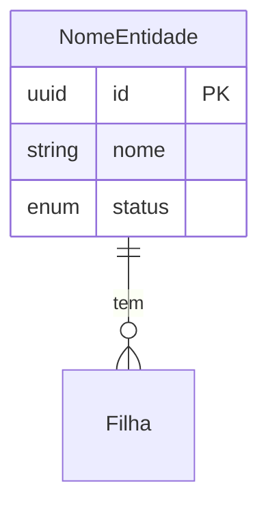

# Modelagem de Entidades — Nome do Sistema

> Template para `.spec/discovery/entities.md`. Estrutura usada pelo skill [`/app-kickoff`](../../.claude/skills/sdd/app-kickoff/SKILL.md) na Fase 3.
> Duas etapas: **Conceitual** (foco no domínio) → validar com usuário → **Técnica** (foco no schema).

---

## Etapa 1 — Modelagem Conceitual

> 📌 Foco em **nomes, descrições, atributos-chave e relacionamentos**. Sem tipos SQL aqui.

### 1. Decisões Transversais

> Decida estes pontos **antes** de modelar as entidades. Cada decisão afeta muitas (ou todas) — mudar depois é caro.
> Marque a opção escolhida e justifique. Se a decisão é case-a-case, registre o critério.

#### 1.1. Estratégia de identificadores

| Opção | Quando |
|-------|--------|
| `UUID` gerado pela aplicação | Distribuído, ID conhecido antes de persistir, útil em sistemas com múltiplos serviços |
| `UUID` gerado pelo BD (`gen_random_uuid()`) | Sem ambiguidade de quem gera; exige SELECT após INSERT |
| `BIGSERIAL` / auto-increment | Schema simples, single-tenant, sem necessidade de distribuição |
| Composto / outro | Casos específicos (chave natural, multi-coluna) |

**Decisão**: ...
**Justificativa**: ...

#### 1.2. Tenancy

| Opção | Quando |
|-------|--------|
| **Single-tenant** | App usado por uma única organização — sem isolamento entre dados |
| **Multi-tenant com RLS** | Múltiplas organizações compartilhando schema; isolamento via Row-Level Security do Postgres |
| **Schema-per-tenant** | Isolamento físico em schemas separados — soberania ou dimensões muito diferentes |
| **Database-per-tenant** | Isolamento extremo — compliance forte, clientes enterprise |

**Decisão**: ...
**Se multi-tenant, identificador do tenant**: ...

#### 1.3. Auditoria

| Opção | Custo | Quando |
|-------|-------|--------|
| **Sem auditoria** | Zero | Sistema interno simples, baixa criticidade |
| **Timestamps básicos** (`criadoEm`, `atualizadoEm`) | Baixo | Maioria dos casos — debug e relatórios |
| **Quem + quando** (`criadoPor`, `atualizadoPor`, `criadoEm`, `atualizadoEm`) | Médio | Quando importa rastrear ação por usuário |
| **Log completo em tabela separada** | Alto | Compliance, perícia, recuperação granular |

**Decisão**: ...
**Aplica a todas entidades ou case-a-case?** ...

#### 1.4. Soft delete

| Opção | Quando |
|-------|--------|
| **Hard delete em todas** | Padrão simples — menos código, queries diretas |
| **Soft delete em todas** (`deletadoEm` nullable) | Recuperação fácil, audit trail; mas exige `WHERE` em toda query |
| **Soft delete case-a-case** | Algumas entidades com soft (com motivo claro), outras com hard |

**Decisão**: ...
**Critério (se case-a-case)**: ...
**Política de purge** (se aplicável): após N dias

#### 1.5. Versionamento de entidades

| Opção | Quando |
|-------|--------|
| **Sem versionamento** | Maioria dos casos — estado atual basta |
| **Histórico em tabela separada** (`<entidade>_versao`) | Quando "ver como estava em data X" é requisito |
| **Coluna `versao` (optimistic locking)** | Concorrência: detectar edição simultânea |
| **Event sourcing** | Quando o estado É derivado de eventos imutáveis |

**Decisão**: ...
**Quais entidades** (se case-a-case): ...

#### 1.6. Enums e catálogos

| Opção | Quando |
|-------|--------|
| **Enum no código** (Java/TS enum + `CHECK` em VARCHAR no BD) | Conjunto fixo, não muda em runtime — padrão recomendado pra valores estáveis |
| **Tabela de catálogo gerenciável** | Admin precisa criar/editar valores sem deploy |
| **Combinação** | Alguns enums fixos, outros como tabelas gerenciáveis |

**Decisão**: ...
**Lista de enums fixos**: declarados em cada domínio abaixo.
**Lista de catálogos gerenciáveis**: declarados como entidades próprias.

---

### 2. Domínio: [Nome do Domínio]

> Origem: Módulos X, Y, Z

#### Entidades

##### 2.1. NomeEntidade

Descrição em 1 linha.

- **Atributos** (sem tipo SQL): `id`, `attr1`, `attr2`, ...
- **Relacionamentos**:
  - **N:1** com `OutraEntidade`
  - **1:N** com `Filha`
  - **N:N** com `Terceira` via `<TabelaJuncao>`
- **Observações específicas**: divergências em relação às decisões transversais (ex: "soft delete: sim — RN-03 exige recuperação", ou "auditoria: log completo — requisito LGPD do módulo X").

##### 2.2. OutraEntidade

Descrição em 1 linha.

- **Atributos**: `id`, `attr1`, ...
- **Relacionamentos**: ...
- **Observações específicas**: ...

#### Enums e Catálogos

##### 2.X. EnumExemplo (enum no código)

Valores: `VALOR_1`, `VALOR_2`, `VALOR_3`.

##### 2.Y. CatalogoExemplo (tabela gerenciável)

Atributos: `id`, `codigo`, `descricao`, `ativo`.

### 3. Domínio: [Próximo Nome]

(repete a estrutura)

---

### N. Visão Consolidada de Relacionamentos

```
RaizDoDominio
 └── Filha (N)
       └── Neta (N)
```

> Ou diagrama em Mermaid quando ficar legível.

### N+1. Decisões de Modelagem (Resolvidas)

| # | Tópico | Decisão |
|---|--------|---------|
| 1 | ... | ... |

### N+2. Pontos a Validar

- [ ] ...

---

## Etapa 2 — Modelagem Técnica

> ⚠️ **Só preencher depois que a Etapa 1 estiver validada com o usuário.**
> As seções abaixo são **condicionais** às decisões transversais — preencha apenas as aplicáveis ao seu projeto.

### 1. Tipos PostgreSQL por atributo

#### Entidade: `NomeEntidade`

| Atributo | Tipo SQL | NOT NULL | UNIQUE | Default | Notas |
|----------|----------|----------|--------|---------|-------|
| `id` | `UUID` | sim | PK | (depende da decisão 1.1) | |
| `nome` | `VARCHAR(120)` | sim | — | — | |
| `status` | `VARCHAR(20)` | sim | — | `'ATIVO'` | CHECK em enum |

> Adicione `tenant_id` se decisão 1.2 foi multi-tenant.
> Adicione `criado_em`/`atualizado_em`/etc se decisão 1.3 incluiu auditoria.
> Adicione `deletado_em` se decisão 1.4 foi soft delete pra esta entidade.

### 2. Constraints

- **CHECK** em campos enum: `status IN ('ATIVO','INATIVO','BLOQUEADO')`
- **UNIQUE** composto: `(<colunas>)` quando aplicável
- **FK ON DELETE/UPDATE**: definir política por relacionamento

### 3. Índices

- **Composto**: `idx_<entidade>_<colunas>` para queries mais frequentes
- **Parcial**: `idx_<entidade>_ativos ... WHERE <condicao>` — útil se há soft delete
- **Texto**: `gin(to_tsvector(...))` se há busca textual

### 4. Políticas RLS

> ⚠️ Aplicável **apenas se a decisão 1.2 foi multi-tenant com RLS**.

```sql
ALTER TABLE <entidade> ENABLE ROW LEVEL SECURITY;

CREATE POLICY <entidade>_isolation ON <entidade>
  USING (tenant_id = current_setting('app.current_tenant')::uuid);
```

### 5. DDL Preliminar

```sql
-- Exemplo mínimo (adapte às decisões transversais)
CREATE TABLE <entidade> (
  id      UUID PRIMARY KEY,
  nome    VARCHAR(120) NOT NULL,
  status  VARCHAR(20) NOT NULL DEFAULT 'ATIVO',

  CONSTRAINT <entidade>_status_valido CHECK (status IN ('ATIVO','INATIVO','BLOQUEADO'))
);
```

### 6. Diagrama ER (Mermaid)



### 7. Decisões técnicas (Resolvidas)

| # | Tópico | Decisão | Motivo |
|---|--------|---------|--------|
| 1 | ... | ... | ... |
