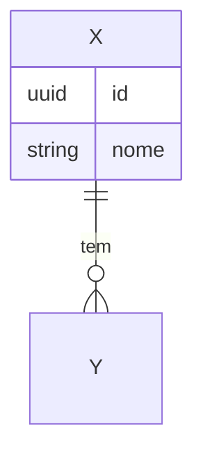

# Plano Técnico — SPEC-<NNN>

> Como vamos construir o que está na [spec.md](./spec.md). Foco em **HOW**, não em **WHAT**.

## 1. Visão geral da abordagem

> 3-5 linhas. Qual estratégia técnica escolhida e por quê.

## 2. Componentes afetados

### Frontend (Angular)

| Componente / Módulo | Tipo de mudança | Notas |
|---------------------|-----------------|-------|
| `features/x/pages/y.component` | Novo | ... |
| `core/auth.service` | Modificado | ... |

### Backend (Spring)

| Pacote / Classe | Tipo de mudança | Notas |
|-----------------|-----------------|-------|
| `feature.x.api.XController` | Novo | ... |
| `feature.x.domain.X` | Novo | Entidade |

### Banco de dados

| Tabela / Migration | Mudança |
|--------------------|---------|
| `V20260101_01__create_x.sql` | Cria tabela `x` |

## 3. Contrato de API

> Resumo. Versão detalhada em [api-contract.md](./api-contract.md) se for não-trivial.

| Endpoint | Método | Descrição | Status code esperado |
|----------|--------|-----------|----------------------|
| `/api/v1/x` | POST | Cria X | 201 |

## 4. Modelo de dados

## 5. Estratégia de testes

- **Unit**: ...
- **Slice tests (Spring)**: `@WebMvcTest XController`, `@DataJpaTest XRepository`
- **Integração**: cenários ponta-a-ponta com Testcontainers
- **E2E (Angular)**: ...

## 6. Observabilidade

- Logs: ...
- Métricas: ...
- Tracing: ...

## 7. Segurança

- Autenticação: ...
- Autorização: ...
- Dados sensíveis: ...

## 8. Performance

- Carga esperada: ...
- Gargalos previstos: ...
- Caching: ...

## 9. Rollout e rollback

- **Feature flag?** Sim/Não. Nome: ...
- **Migration reversível?** ...
- **Plano de rollback**: ...

## 10. Decisões arquiteturais

> Se gerou ADR, linke aqui. ADRs vivem em `.spec/archive/adr/` ou pasta dedicada do projeto.

- ADR-XXX: ...

## 11. Riscos técnicos

| Risco | Probabilidade | Impacto | Mitigação |
|-------|---------------|---------|-----------|
| ... | baixa/média/alta | baixo/médio/alto | ... |
