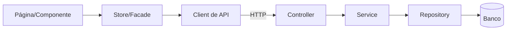

# Arquitetura — Nome do Projeto

> Gerado por [`/project-onboard`](../SKILL.md) a partir de leitura cirúrgica do código.
> Consumido por `/spec-plan` e `/spec-review` pra manter novas features coerentes com o que já existe.
> Marque com 🔎 tudo que é **inferência** (ainda não confirmado no código).

## 1. Visão geral

> 3-5 linhas: que tipo de sistema é, estilo arquitetural (monolito em camadas, hexagonal, DDD, microserviços, etc.) e topologia (monolito / monorepo / multi-repo).

## 2. Stack detectado

> Versões **reais**, com a fonte (arquivo onde foi lida). Nada de suposição.

| Camada | Tecnologia | Versão | Fonte |
|--------|-----------|--------|-------|
| Frontend | Angular | 18.x | `web/package.json` |
| Backend | Spring Boot | 3.x | `api/pom.xml` |
| Banco | PostgreSQL | 16 | `docker-compose.yml` |
| Build / Pkg | ... | ... | ... |
| Qualidade | ESLint / Prettier / JUnit | ... | ... |

## 3. Topologia e estrutura de pastas

> Estrutura de **alto nível** (não listar tudo). Onde mora o quê.

```
.
├── api/        # backend Spring — bounded contexts em ...
└── web/        # frontend Angular — features em ...
```

## 4. Módulos / Bounded contexts

| Módulo / Contexto | Responsabilidade | Onde fica |
|-------------------|------------------|-----------|
| ... | ... | ... |

## 5. Fluxo de referência (feature rastreada)

> A feature ponta-a-ponta usada pra entender a arquitetura. Mostra o "caminho" que toda feature percorre.

**Feature**: `<nome>`



- **Onde mora a regra de negócio**: ...
- **Tratamento de erro**: ...
- **Limite transacional**: ...
- **Autenticação/autorização**: ...

## 6. Integrações externas

| Com | Tipo | Direção | Onde no código |
|-----|------|---------|----------------|
| ... | REST / fila / webhook | consome / expõe | ... |

## 7. Como adicionar uma nova feature (caminho feliz)

> O passo-a-passo que uma SPEC nova deve seguir pra encaixar na arquitetura existente.

1. ...
2. ...

## 8. Decisões arquiteturais observadas e dívidas

| Item | Tipo | Nota |
|------|------|------|
| ... | padrão a seguir / dívida a evitar / tensão | ... |

## 9. Inferências a confirmar

- [ ] 🔎 ...
